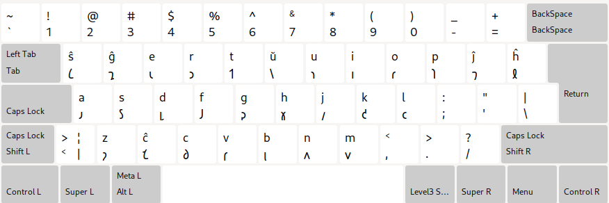
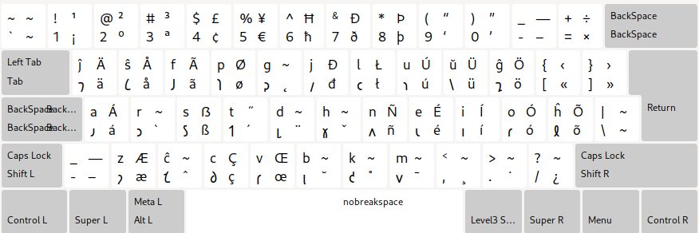

# Есперанто шавианска клавиатурна подредба

Превод: [english](README.md), [esperanto](README.eo.md), [𐑖𐑨𐑝𐑨 𐑧𐑕𐑐𐑧𐑮𐑨𐑵𐑑𐑩](README.eo_shaw.md), [中文](README.zh-CN.md), [español](README.es.md), [العربية](README.ar.md), [português](README.pt.md), [русский](README.ru.md), [bahasa](README.id.md), [türkçe](README.tr.md)

### QWERTY

### Colemak

Това е моят опит да направя клавиатурни подредби, базирани на QWERTY и Colemak, адаптирани за есперантската шавианска азбука.

## Връзки

* [Начална страница](https://salif.github.io/shaw-eo/)
* [Програмен код](https://codeberg.org/salif/shaw-eo)
* [Дискусии (Github)](https://github.com/salif/shaw-eo/discussions)
* [Чат стая (Element/Matrix)](https://matrix.to/#/#salif-colemak:mozilla.org)

## Инсталиране

### Инсталиране в Linux

#### QWERTY

Вижте тази страница: [LINUX.bg.md#qwerty](./LINUX.bg.md#qwerty)

#### Colemak

Вижте тази страница: [LINUX.bg.md#colemak](./LINUX.bg.md#colemak)

### Инсталиране в други операционни системи

Не мога да ви помогна, опитайте сами да намерите начин да инсталирате на вашата ОС.

## Принос

Ако откриете грешка или искате да предложите подобрение, не се колебайте да го споделите в [Codeberg] или [Github] или изпратете заявка за сливане.

[Github]: https://github.com/salif/shaw-eo/discussions
[Codeberg]: https://codeberg.org/salif/shaw-eo/issues

## Други клавиатурни подредби

* [За езика есперанто](https://salif.github.io/colemak-eo/)
* [За турски език](https://salif.github.io/colemak-tr/)
* [За български език](https://salif.github.io/colemak-bg/)
