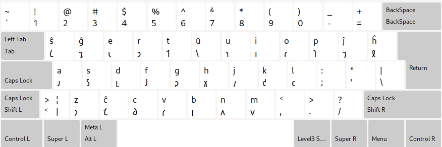

# Tata letak keyboard Esperanto Shavian

Terjemahan: [english](README.md), [esperanto](README.eo.md), [𐑖𐑨𐑝𐑨 𐑧𐑕𐑐𐑧𐑮𐑨𐑵𐑑𐑩](README.eo_shaw.md), [中文](README.zh-CN.md), [español](README.es.md), [العربية](README.ar.md), [português](README.pt.md), [русский](README.ru.md), [türkçe](README.tr.md), [български](README.bg.md)

### QWERTY

### Colemak

Ini adalah upaya saya membuat layout keyboard berdasarkan QWERTY dan Colemak, yang diadaptasi untuk alfabet Esperanto Shavian.

## Tautan

* [Beranda](https://salif.github.io/shaw-eo/)
* [Kode sumber](https://codeberg.org/salif/shaw-eo)
* [Diskusi (Github)](https://github.com/salif/shaw-eo/discussions)
* [Ruang obrolan (Element/Matrix)](https://matrix.to/#/#salif-colemak:mozilla.org)

## Menginstal

### Menginstal di Linux

#### QWERTY

Lihat halaman ini : [LINUX.id.md#qwerty](./LINUX.id.md#qwerty)

#### Colemak

Lihat halaman ini : [LINUX.id.md#colemak](./LINUX.id.md#colemak)

### Menginstal di sistem operasi lain

Saya tidak dapat membantu Anda, coba cari sendiri cara untuk menginstalnya di OS Anda.

## Berkontribusi

Jika Anda menemukan bug atau ingin menyarankan perbaikan, silakan membagikannya di [Codeberg] atau [Github], atau kirimkan permintaan penarikan.

[Github]: https://github.com/salif/shaw-eo/discussions
[Codeberg]: https://codeberg.org/salif/shaw-eo/issues

## Tata letak keyboard lainnya

* [Untuk bahasa Esperanto](https://salif.github.io/colemak-eo/)
* [Untuk bahasa Rusia](https://salif.github.io/colemak-ru/)
* [Untuk bahasa Turki](https://salif.github.io/colemak-tr/)
* [Untuk bahasa Bulgaria](https://salif.github.io/colemak-bg/)

---

Halaman ini berisi teks yang diterjemahkan secara otomatis
