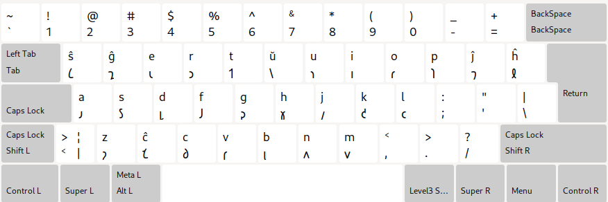
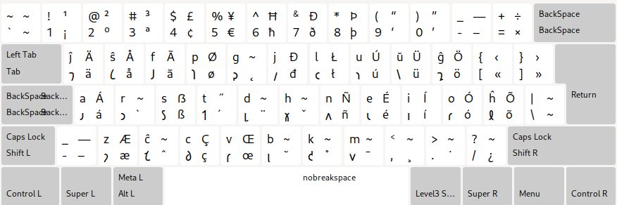

# Esperanto \(Shavian\) keyboard layout

In other languages: [Esperanto](README.eo.md), [𐑖𐑨𐑝𐑨 𐑧𐑕𐑐𐑧𐑮𐑨𐑵𐑑𐑩](README.eo_shaw.md)

---

### QWERTY

### Colemak

## Install on Linux

### QWERTY

See [LINUX.md](./LINUX.md#qwerty) for QWERTY

### Colemak

See [LINUX.md](./LINUX.md#colemak) for Colemak
